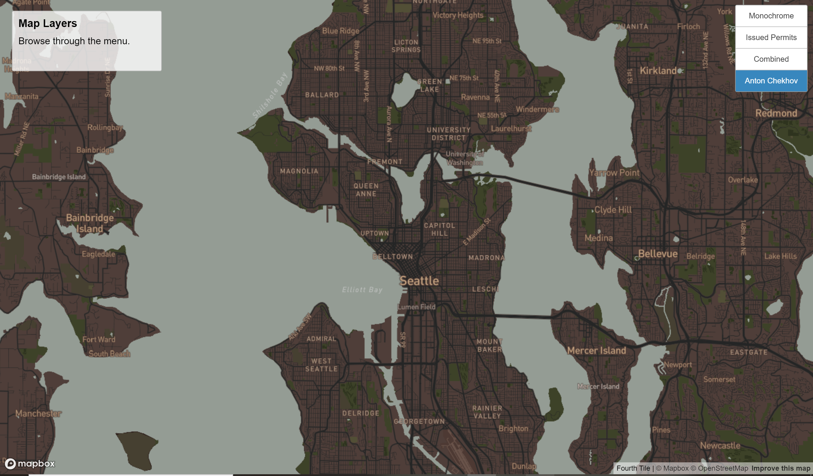

# Map Design and Tile Generation
This project aims to design multiple map layers and convert them as tilesets to display online as a [web map of Seattle](https://cathyluc.github.io/Map_Design_Tile_Generation/index.html). The tiles have a maximum zoom-in level of 14 and minimum of 3. 

## First Tile: Edited Monochrome
The first tile is a monochrome base map provided by `Mapbox` [basemap gallery](https://www.mapbox.com/gallery/). The background color and text fonts of the labels are changed for aesthetic effect.

## Second Tile: Residential Permits Issued in 2022
This is a dot density layer with each dot representing a residential permit issued in Seatle in 2022. The data is from Seattle Geodata _Built Units Since 2010_. 

## Thrid Tile: First and Second Tiles Combined
The thrid tile is composed of the thematic layer from the second tile set and the basemap from the first one.

## Fourth Tile: Theme of Anton Chekhov
In memory of Anton Chekhov and his brithday on January 29th, the map style is generated from `Mapbox Cartogram` using a [portrait](https://en.wikipedia.org/wiki/Anton_Chekhov#/media/File:Chekhov_1898_by_Osip_Braz.jpg) of Anton Chekhov by Osip Braz.

## Data Source
- [Seattle GeoData](https://data-seattlecitygis.opendata.arcgis.com/datasets/SeattleCityGIS::built-units-since-2010/explore?location=47.619210%2C-122.268552%2C11.00)
